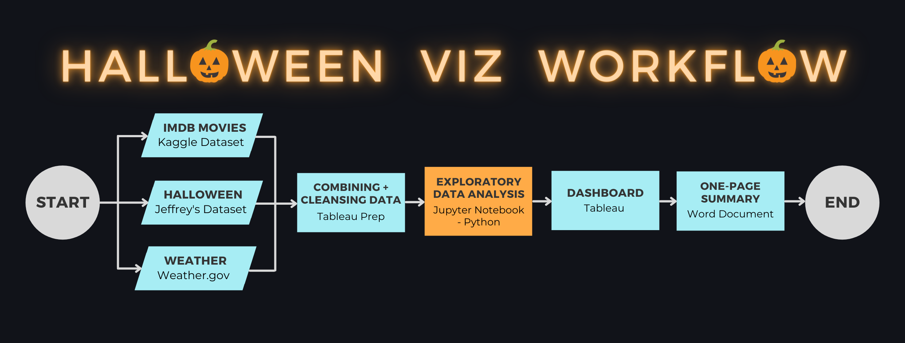
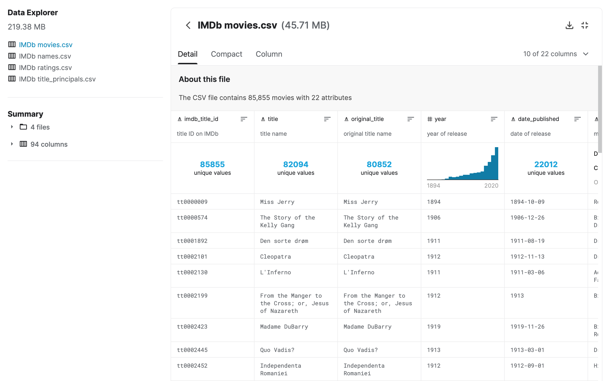
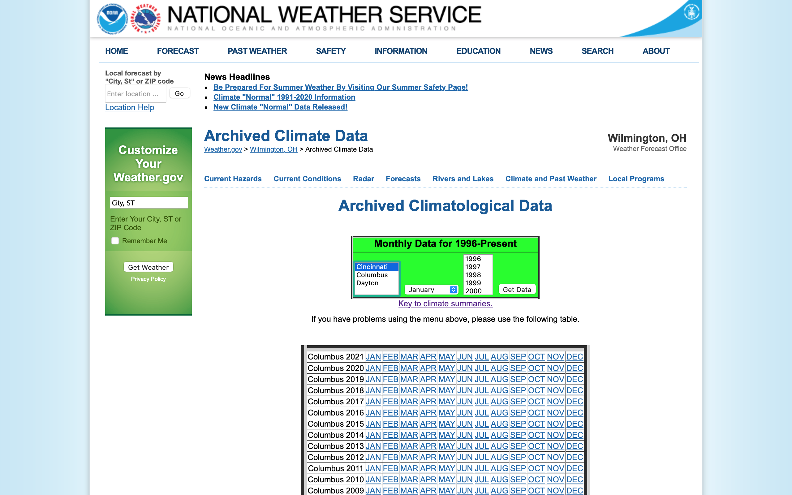
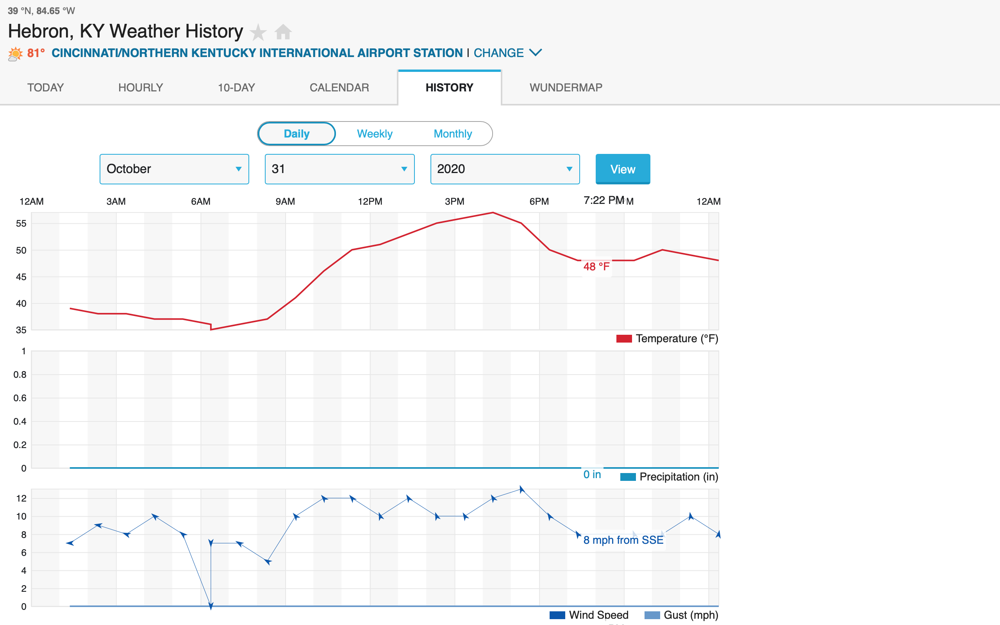
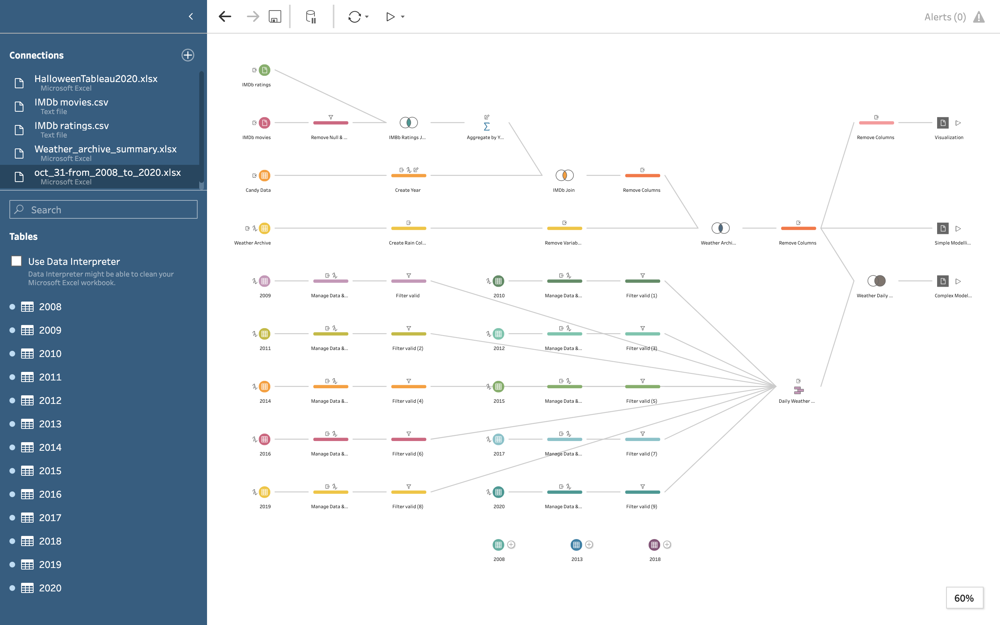

# Visualizing Jeff's Trick-or-Treat Data :ghost:

 

 
 
 

Above is the expected workflow. The block highlighted in `orange` is the current position of the project.

## Project Overview
Halloween Viz! In this project, we had to explore the small dataset created by Jeffrey A. Shaffer, a resident of Cincinnatti. The dataset counts the number of candies given out on Halloween by Jeffrey each year. The dataset is combined with two other datasets to better understand the trends in the number of candies given out. A dashboard in Tableau is created to summarize the insights gained from the data.

## Goal
> **Carry out EDA and create a dashboard summarizing the most important insights gained to better understand the number of candies to be given out in a particular year.**

## Project Specifics

### Who is the audience?
The audience in this case will be Jeffrey A. Shaffer. The goal is to provide Jeffrey with a dashboard that he can exploit to determine the number of candies to buy for halloween.

#### Fictional Audience Background
Jeffrey is a resident of Cincinnati and has been keep on doing his bit to prevent global warming. He has installed solar panels and a hybrid electric grid for his house. This helps him efficiently manage his energy use. Jeffrey also works as a data scientist to educate others of the consequences of neglecting climate change and how it can be prevented. He tries his best to reduce is carbon footprint by cycling, reusing and recycling.

---

From Jeffrey's background, we can decipher that he would not want to waste candies on Halloween. Due to the pandemic caused by Covid-19, Jeffrey saw a drop in the number of trick-or-treaters. He ended up over-estimating the number of candies. He was left with over 100 candies he did not know what to do of. Therefore, he has decided to dig deeper into the data he has been collecting since 2012. He wanted to waste a minimum number of candies. In this project we help Jeffrey reduce his halloween waste.

### About the Dataset
Variables:
1. Number of candies
2. Date
3. Time

The data is collected between 6:30 and 8:15, every half an hour.

## Breaking down the Workflow
In this section, we will give a brief description of each process shown in the workflow.

### Data Collection
Three data sources are used in this project.

#### 1. Jeffrey's Halloween Dataset
The data was downloaded from the [dataplusscience website](https://www.dataplusscience.com/HalloweenData.html).

#### 2. IMDb Movies Dataset
This dataset was downloaded from [Kaggle](https://www.kaggle.com/stefanoleone992/imdb-extensive-dataset).

#### 3. Cincinnati Weather Dataset
The weather data is taken from two different locations:

1. [Weather Archives](https://www.weather.gov/iln/lcd_archive)

Data from this source is in the from of PDF documents containing monthly weather data. PDF documents containing October data from year 2008 to 2020 are downloaded. All these files can be found in the [raw data directory](Data/Raw/Weather/monthly). The `Weather_archive_summary.xlsx` file in [weather directory](Data/Raw/Weather) contains weather data for October 31 of each year from 2008 to 2020 extracted from the PDF documents.

2. [Weather Underground](https://www.wunderground.com/history/daily/us/ky/hebron/KCVG/date/2020-10-31)

This sources contains weather data measured at different times in a given day. Data for the years 2008, 2013 and 2018 is missing. The data was copied from the webpage and pasted into an excel document. A different sheet is created for each year. The data can be found in the [daily weather directory](Data/Raw/Weather/daily).

This is an additional data source to be used to develop a more complex machine learning model. The dashboard will not contain data extracted from this data source. 

### Combining & Cleansing Data
**Tableau Prep** is used to carry out the combining and cleansing of the datasets. Following a picture of the workflow created in Tableau Prep.

The file can be found in the [data directory](Data).

### Exploratory Data Analysis (EDA)
**Python** (Jupyter Notebook) will be used to carry to the EDA. This will involve finding trends in the data through visualizations.

### Dashboard Creation
**Tableau** will be used to create the dashboard based on the important insights developed in the EDA that will be used by Jeffrey.

### One-Page Summary
A **Microsoft Word** document will be compiled to explain the functionality of the dashboard.

## SUPPORT
I am looking for a job opportunity as a Software Developer and eventually Machine Learning Engineer in Canada. It would mean a lot if we could connect and discuss what we can do for each other. Follow and reach out to me on one of the following places ⬇️

 

## LICENSE

**[MIT license](https://opensource.org/licenses/MIT)**
